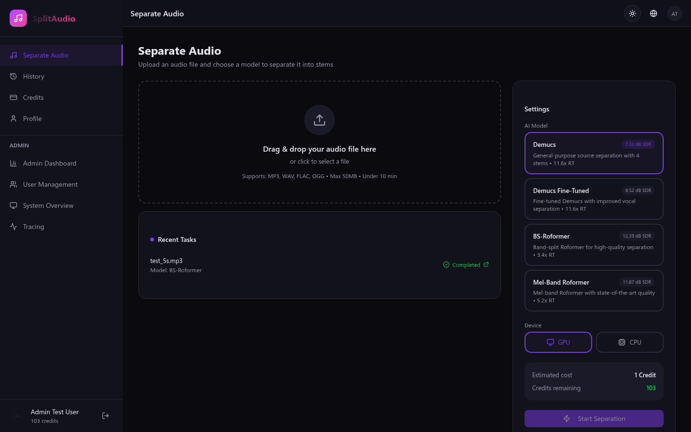

# Audio Separation Service

A full-stack audio separation platform with a React frontend and microservices backend for AI-powered vocal and instrumental separation using state-of-the-art ML models (Demucs v4 and Mel-Band RoFormer). Users upload audio files through a modern web UI, spend credits per separation, and download the separated stems via pre-signed MinIO URLs.



---

## Architecture

> **Note:** The architecture diagram below shows the backend microservices setup. The frontend React application runs separately in development mode (`npm run dev`) and communicates with the backend via REST API.

```
                        ┌─────────────────────────────────────────────────────┐
                        │                   Docker Network                    │
                        │                                                     │
  Client (Browser/curl) │                                                     │
         │              │  ┌──────────┐     ┌──────────────────────────────┐  │
         │  HTTP :80    │  │          │     │         App Service           │  │
         └─────────────►│  │  Nginx   │────►│  FastAPI + Uvicorn  :8000    │  │
                        │  │ (proxy + │     │  ┌─auth ─credits ─tasks    ┐ │  │
                        │  │rate-lim) │     │  │  separate  admin  users  │ │  │
                        │  └──────────┘     │  └──────────────────────────┘ │  │
                        │                  └──────────┬───────────────────────┘  │
                        │                             │                          │
                        │           ┌─────────────────┼──────────────────┐       │
                        │           │                 │                  │       │
                        │    ┌──────▼──────┐   ┌──────▼──────┐   ┌──────▼────┐  │
                        │    │ PostgreSQL  │   │    Redis     │   │   MinIO   │  │
                        │    │  :5432      │   │   :6379      │   │   :9000   │  │
                        │    │ (users,     │   │ (task queue  │   │ (audio    │  │
                        │    │  tasks,     │   │  + rate lim) │   │  files)   │  │
                        │    │  credits)   │   └──────┬───────┘   └──────▲────┘  │
                        │    └─────────────┘          │                  │       │
                        │                             │                  │       │
                        │                    ┌────────▼────────┐         │       │
                        │                    │  Celery Worker  │─────────┘       │
                        │                    │  (concurrency=2)│                 │
                        │                    └────────┬────────┘                 │
                        │                             │ HTTP POST /predict        │
                        │                    ┌────────▼────────┐                 │
                        │                    │  Model Serving  │                 │
                        │                    │  FastAPI :8001  │                 │
                        │                    │  Demucs v4      │                 │
                        │                    │  Mel-RoFormer   │                 │
                        │                    └─────────────────┘                 │
                        │                                                        │
                        └────────────────────────────────────────────────────────┘
```

### Services

| Service | Image / Build | Role | Technology |
|---|---|---|---|
| **frontend** | Vite dev server | Web UI, user interaction, file upload interface | TypeScript, React 19, Vite 8 |
| **nginx** | `nginx:1.25-alpine` | Reverse proxy, TLS termination, rate limiting | Nginx 1.25 |
| **app** | `./backend/app` | REST API, auth, job submission, credit management | Python 3.11, FastAPI, SQLAlchemy 2.0 async |
| **worker** | `./backend/worker` | Async job processor, model inference orchestration | Python 3.11, Celery 5.4, httpx |
| **model-serving** | `./backend/model_serving` | ML inference server, model lifecycle management | Python 3.11, FastAPI, PyTorch, Demucs v4, Mel-RoFormer |
| **postgres** | `postgres:15-alpine` | Relational store for users, tasks, credits, tokens | PostgreSQL 15 |
| **redis** | `redis:7-alpine` | Celery broker/backend, sliding-window rate limiter | Redis 7 |
| **minio** | `minio/minio:latest` | S3-compatible object storage for audio files | MinIO |
| **flower** | `mher/flower:2.0` | Celery task monitoring dashboard (`:5555`) | Flower 2.0 |

### Communication Patterns

- **User → Frontend**: Browser renders React SPA, handles file uploads, displays task status
- **Frontend → App**: HTTP/1.1 REST API calls (Axios), JWT Bearer auth, TanStack Query for caching
- **Client → Nginx → App** (production): HTTP/1.1, Nginx enforces per-IP rate limits (30 req/min general, 5 req/min upload)
- **App → Redis**: Celery `send_task()` enqueues separation jobs; also used for Redis INCR+EXPIRE rate limiting
- **App → PostgreSQL**: Async SQLAlchemy sessions for all DB reads/writes
- **App → MinIO**: `minio` SDK — uploads input audio, generates pre-signed download URLs for output
- **Worker → Redis**: Celery worker pulls jobs from queue
- **Worker → PostgreSQL**: Raw async SQLAlchemy (no ORM) to update task status and issue credit refunds
- **Worker → MinIO**: Downloads input audio, uploads separated stems
- **Worker → Model Serving**: `httpx` POST to `http://model-serving:8001/predict` — sends audio, receives ZIP of stems

---

## Tech Stack

### Backend

| Layer | Technology |
|---|---|
| Language | Python 3.11 |
| API Framework | FastAPI 0.111 |
| ORM | SQLAlchemy 2.0 (async) |
| Migrations | Alembic 1.13 |
| Task Queue | Celery 5.4 |
| Message Broker | Redis 7 |
| Auth | JWT (python-jose) + bcrypt (passlib) |
| Object Storage | MinIO (S3-compatible) |
| Database | PostgreSQL 15 |
| ML Models | Demucs v4, Mel-Band RoFormer |
| ML Framework | PyTorch 2.1 (CUDA-optional) |
| Audio I/O | torchaudio, soundfile, mutagen |

### Frontend

| Layer | Technology |
|---|---|
| Language | TypeScript 5.9 |
| Framework | React 19.2 |
| Build Tool | Vite 8.0 |
| Routing | React Router 7.13 |
| State Management | Zustand 5.0 |
| Server State | TanStack React Query 5.90 |
| API Client | Axios 1.13 |
| UI Components | Radix UI 1.4 |
| Styling | Tailwind CSS 4.2 |
| Internationalization | i18next 25.8 |
| Charts | Recharts 3.8 |
| Theme | next-themes 0.4 |
| Icons | lucide-react 0.577 |
| Notifications | sonner 2.0 |

### Infrastructure

| Layer | Technology |
|---|---|
| Containerization | Docker, Docker Compose |
| Reverse Proxy | Nginx 1.25 |

---

## Quick Start

### Backend Services

```bash
git clone <repo-url>
cd audio-separation

# Copy and fill in secrets
cp .env.example .env
# Edit .env: set SECRET_KEY, POSTGRES_PASSWORD, MINIO_SECRET_KEY

# Build and start backend services (test environment)
docker compose up --build
```

> **Note:** The `docker-compose.yml` in the root is configured for testing with test database credentials and ports (PostgreSQL :5433, Redis :6380, MinIO :9002). For production, adjust the configuration accordingly.

> **Note:** Allow ~2 minutes on first boot for the `model-serving` container to download model weights from HuggingFace / torch.hub. Watch progress with `docker compose logs -f model-serving`.

### Frontend Development

```bash
cd frontend

# Install dependencies
npm install

# Start development server
npm run dev

# Build for production
npm run build
```

The frontend dev server will run on `http://localhost:5173` by default and proxy API requests to the backend.

### Access Points

Once all services are running:

| Endpoint | URL | Description |
|---|---|---|
| Frontend (dev) | http://localhost:5173 | React development server |
| API Swagger UI | http://localhost:8000/docs | Interactive API documentation |
| API ReDoc | http://localhost:8000/redoc | Clean API reference |
| MinIO Console | http://localhost:9003 | Object storage admin (test env) |
| Flower Dashboard | http://localhost:5555 | Celery task monitoring |

---

## Model Weights

| Model | Source | Notes |
|---|---|---|
| **Demucs v4** (`htdemucs`) | Auto-downloaded via `torch.hub` on first run | Cached in Docker volume `model_weights` |
| **Mel-Band RoFormer** | Downloaded from HuggingFace on first run | Cached in Docker volume `model_weights` |

Weights are cached in the `model_weights` Docker volume so they survive container restarts. To pre-download manually:

```bash
docker compose run --rm model-serving python download_weights.py
```

---

## Model Serving Communication

The Worker communicates with Model Serving via a simple REST call:

```
Worker                          Model Serving (:8001)
  │                                     │
  │  POST /predict?model=demucs         │
  │  Content-Type: multipart/form-data  │
  │  Body: file=<audio bytes>           │
  │────────────────────────────────────►│
  │                                     │  Run inference (FP16, GPU if available)
  │                                     │  Semaphore limits concurrency to 2
  │  200 OK                             │
  │  Content-Type: application/zip      │
  │  Body: stems.zip (vocals + instrum) │
  │◄────────────────────────────────────│
  │                                     │
  │  Unzip, upload each stem to MinIO   │
  │  Update task status → "completed"   │
```

The inference semaphore (`asyncio.Semaphore(2)`) in model-serving prevents OOM under concurrent load.

---

## Frontend Features

The React TypeScript frontend provides a comprehensive user interface with the following features:

### Core Pages

| Page | Route | Features |
|---|---|---|
| **Auth** | `/login`, `/register` | User registration with welcome credits, JWT login, token refresh |
| **Dashboard** | `/` | Quick upload widget, recent tasks, credit balance card |
| **Separate** | `/separate` | Multi-model selector (Demucs, RoFormer), file upload with progress, drag & drop |
| **History** | `/history` | Paginated task list, status filters, search, retry failed jobs |
| **Task Detail** | `/task/:id` | Real-time status updates, stem download buttons, audio player, waveform display |
| **Profile** | `/profile` | Edit display name/email, change password, language switcher, account deletion |
| **Credits** | `/credits` | Balance overview, transaction history, purchase/redeem flows |

### Admin Features

| Page | Route | Features |
|---|---|---|
| **Admin Dashboard** | `/admin` | Platform stats (users, tasks, credits), charts (Recharts) |
| **User Management** | `/admin/users` | User table, search, credit adjustment modal, activate/deactivate |
| **System Monitoring** | `/admin/system` | Service health checks, database stats, Redis metrics |
| **Tracing** | `/admin/tracing` | Request logs, task traces, timeline visualization |

### UI Components & Libraries

- **Authentication**: Protected routes, auto token refresh, logout with blacklist
- **State Management**:
  - Zustand for client state (auth, theme)
  - TanStack React Query for server state with automatic cache invalidation
- **UI Framework**: Radix UI primitives (Dialog, DropdownMenu, Select, Tabs, etc.)
- **Styling**: Tailwind CSS 4.2 with custom design system
- **Theming**: Light/dark mode toggle (next-themes)
- **Internationalization**: i18next with language detector, multi-language support
- **Notifications**: Toast notifications (sonner) for success/error feedback
- **Icons**: lucide-react icon library
- **Charts**: Recharts for admin analytics

### User Experience

- **Responsive Design**: Mobile-first, adaptive navigation (sidebar on desktop, mobile nav on mobile)
- **Real-time Updates**: Polling task status, progress indicators
- **Error Handling**: Error boundaries, user-friendly error messages
- **Accessibility**: ARIA labels, keyboard navigation, screen reader support
- **Loading States**: Skeleton loaders, spinners, progress bars

---

## API Documentation

- **Swagger UI**: http://localhost/docs — interactive, supports file upload and Bearer auth
- **ReDoc**: http://localhost/redoc — clean reference documentation
- **OpenAPI JSON**: http://localhost/openapi.json

### API Endpoints

| Method | Path | Auth | Description |
|---|---|---|---|
| GET | `/health` | None | Service health check |
| **Auth** | | | |
| POST | `/api/v1/auth/register` | None | Register new account (10 welcome credits) |
| POST | `/api/v1/auth/login` | None | Login, receive access + refresh tokens |
| POST | `/api/v1/auth/refresh` | None | Exchange refresh token for new access token |
| POST | `/api/v1/auth/logout` | Bearer | Blacklist current access token |
| PUT | `/api/v1/auth/change-password` | Bearer | Change account password |
| **Users** | | | |
| GET | `/api/v1/users/me` | Bearer | Get current user profile |
| PUT | `/api/v1/users/me` | Bearer | Update display name or email |
| DELETE | `/api/v1/users/me` | Bearer | Delete account (cascades all data) |
| **Separation** | | | |
| POST | `/api/v1/separate` | Bearer | Upload audio file, queue separation job |
| **Tasks** | | | |
| GET | `/api/v1/status/{task_id}` | Bearer | Get task status + download URLs |
| GET | `/api/v1/history` | Bearer | Paginated task history |
| DELETE | `/api/v1/tasks/{task_id}` | Bearer | Cancel pending task + refund credits |
| POST | `/api/v1/tasks/{task_id}/retry` | Bearer | Retry a failed task |
| GET | `/api/v1/tasks/{task_id}/download/{stem}` | Bearer | Redirect to pre-signed download URL |
| **Credits** | | | |
| GET | `/api/v1/credits/balance` | Bearer | Current credit balance + stats |
| GET | `/api/v1/credits/transactions` | Bearer | Paginated transaction history |
| POST | `/api/v1/credits/purchase` | Bearer | Add credits (mock purchase) |
| POST | `/api/v1/credits/redeem` | Bearer | Redeem promo code |
| **Admin** | | | |
| GET | `/api/v1/admin/users` | Bearer (admin) | List all users |
| GET | `/api/v1/admin/stats` | Bearer (admin) | Platform-wide statistics |
| PUT | `/api/v1/admin/users/{user_id}/credits` | Bearer (admin) | Adjust user credits |

---

## Test Flow (cURL)

> **Note:** You can also use the frontend web UI at `http://localhost:5173` (dev mode) for a graphical interface to test these flows.

### 1. Register

```bash
curl -s -X POST http://localhost:8000/api/v1/auth/register \
  -H "Content-Type: application/json" \
  -d '{"email":"test@example.com","password":"secret123","display_name":"Test User"}' \
  | jq .
```

### 2. Login

```bash
TOKEN=$(curl -s -X POST http://localhost:8000/api/v1/auth/login \
  -H "Content-Type: application/json" \
  -d '{"email":"test@example.com","password":"secret123"}' \
  | jq -r .access_token)

echo "Token: $TOKEN"
```

### 3. Upload Audio for Separation

```bash
TASK=$(curl -s -X POST http://localhost:8000/api/v1/separate \
  -H "Authorization: Bearer $TOKEN" \
  -F "file=@/path/to/your/song.mp3" \
  -F "model=demucs" \
  | jq -r .task_id)

echo "Task ID: $TASK"
```

### 4. Check Task Status

```bash
curl -s http://localhost:8000/api/v1/status/$TASK \
  -H "Authorization: Bearer $TOKEN" \
  | jq '{status: .status, download_urls: .download_urls}'
```

Keep polling until `"status": "completed"`, then use the `download_urls` to fetch each stem.

### 5. Check Credit Balance

```bash
curl -s http://localhost:8000/api/v1/credits/balance \
  -H "Authorization: Bearer $TOKEN" \
  | jq .
```

---

## Testing

### Backend Tests

```bash
# Start test environment (separate Docker Compose with test DB + Redis)
make test-up

# Run the full test suite
make test

# Tear down test environment
make test-down

# Generate coverage report
make test-coverage
```

### Test Categories

| Category | Location | Description |
|---|---|---|
| Unit | `backend/tests/unit/` | Pure logic tests — auth, credit calculations, validators |
| Integration | `backend/tests/integration/` | DB + Redis interactions, service layer |
| End-to-end | `backend/tests/e2e/` | Full HTTP flows against test FastAPI instance |

### Frontend Development

The frontend uses Vite for development with hot module replacement (HMR). Run linting with:

```bash
cd frontend
npm run lint
```

---

## Design Decisions

### 1. Handling 100 Simultaneous Users

The system has **four layers of back-pressure** to stay stable under load:

1. **Nginx** enforces per-IP request rates (`limit_req_zone`) — 30 req/min for general API, 5 req/min for uploads. Bursts are absorbed up to a threshold then hard-rejected with 429 before requests hit the app.
2. **Redis sliding-window rate limiter** in the FastAPI middleware provides per-path limits at the application layer (e.g. 10 logins/min, 5 registrations/min) as a second defence.
3. **FastAPI / Uvicorn** handles concurrent HTTP connections asynchronously. The app never blocks the event loop — all DB queries use `asyncpg` and storage calls are either async or offloaded to a thread pool.
4. **Celery worker concurrency=2** serialises the GPU-bound inference work. Separation jobs queue in Redis and are processed two at a time, preventing OOM on the model-serving container. The `asyncio.Semaphore(2)` inside model-serving adds a matching guard at the inference layer.

Result: 100 simultaneous HTTP requests are handled by Nginx + FastAPI without queuing, while separation jobs drain through the Celery queue at a controlled rate.

### 2. Credit Fairness and Automatic Refunds

Credits are deducted **before** work begins and refunded **on any failure**:

- `CreditService.deduct()` uses an atomic SQL `UPDATE users SET credits = credits - $amount WHERE credits >= $amount`, so concurrent requests cannot over-spend.
- Every deduction writes a `credit_transactions` row (`type='deduction'`).
- If MinIO upload fails in the API handler, `CreditService.refund()` is called immediately in the same DB transaction.
- If the Celery worker fails at any point (network error, model error, timeout), `_refund_credits_db()` finds the original deduction by `task_id` and issues a matching `type='refund'` transaction, then updates the user's balance atomically.
- The `credit_transactions` table is an immutable audit log — every deduction, refund, purchase, and redemption is recorded with `created_at` and a `description`.

### 3. Model Optimisation Strategies

| Strategy | Implementation |
|---|---|
| **FP16 inference** | Both `DemucsHandler` and `RoFormerHandler` cast models to `torch.float16` when CUDA is available, halving GPU memory and increasing throughput |
| **Warm models** | Models are loaded once at startup via `lifespan` and held in the `_handlers` dict; there is no per-request load/unload overhead |
| **Inference serialisation** | `asyncio.Semaphore(2)` prevents concurrent inference from exhausting GPU VRAM |
| **Result caching** (future) | Output stems are stored permanently in MinIO — re-processing the same file could be short-circuited by hashing the input key |
| **ONNX export** (future) | Both model architectures are ONNX-exportable; converting to ONNX + TensorRT would give 2–4× inference speedup on NVIDIA GPUs |
| **CPU fallback** | Both handlers detect `torch.cuda.is_available()` and fall back to CPU when no GPU is present, so the service runs on CPU-only machines |

---

## Project Structure

```
audio-separation/
├── backend/                    # Backend services
│   ├── app/                    # FastAPI application
│   │   ├── Dockerfile
│   │   ├── requirements.txt
│   │   ├── main.py             # App entrypoint, router registration
│   │   ├── config.py           # Pydantic settings from .env
│   │   ├── database.py         # Async SQLAlchemy engine + session
│   │   ├── celery_client.py    # Thin Celery client for job submission
│   │   ├── models/             # SQLAlchemy ORM models
│   │   │   ├── user.py
│   │   │   ├── audio_task.py
│   │   │   ├── credit_transaction.py
│   │   │   └── token_blacklist.py
│   │   ├── schemas/            # Pydantic v2 request/response schemas
│   │   │   ├── user.py
│   │   │   └── task.py
│   │   ├── routers/            # FastAPI route handlers
│   │   │   ├── auth.py         # /api/v1/auth/*
│   │   │   ├── users.py        # /api/v1/users/*
│   │   │   ├── separate.py     # /api/v1/separate
│   │   │   ├── tasks.py        # /api/v1/status|history|tasks/*
│   │   │   ├── credits.py      # /api/v1/credits/*
│   │   │   └── admin.py        # /api/v1/admin/*
│   │   ├── services/           # Business logic
│   │   │   ├── auth_service.py     # JWT + bcrypt
│   │   │   ├── credit_service.py   # Atomic credit operations
│   │   │   ├── storage_service.py  # MinIO wrapper
│   │   │   └── audio_service.py    # File validation, duration
│   │   ├── middleware/
│   │   │   └── rate_limiter.py     # Redis sliding-window rate limiter
│   │   └── utils/
│   │       └── dependencies.py     # FastAPI Depends: get_db, get_current_user
│   │
│   ├── worker/                 # Celery worker
│   │   ├── Dockerfile
│   │   ├── requirements.txt
│   │   ├── celery_app.py
│   │   └── tasks/
│   │       └── separation_task.py  # Core separation task
│   │
│   └── model_serving/          # ML inference service
│       ├── Dockerfile
│       ├── requirements.txt
│       ├── main.py             # FastAPI: /health /models /predict
│       ├── download_weights.py
│       └── models/
│           ├── demucs_handler.py
│           └── roformer_handler.py
│
├── frontend/                   # React TypeScript SPA
│   ├── package.json
│   ├── tsconfig.json
│   ├── vite.config.ts
│   ├── index.html
│   ├── public/                 # Static assets
│   └── src/
│       ├── main.tsx            # App entry point
│       ├── App.tsx             # Root component, routing setup
│       ├── router/             # Route definitions
│       ├── components/         # React components
│       │   ├── auth/           # Login, register forms
│       │   ├── dashboard/      # Quick upload, recent tasks, credits
│       │   ├── tasks/          # Task list, filters, actions
│       │   ├── separation/     # Upload progress, model selector
│       │   ├── credits/        # Balance card, transactions
│       │   ├── profile/        # User settings, password, language
│       │   ├── admin/          # User management, stats, tracing
│       │   ├── audio/          # Audio player, waveform display
│       │   ├── layout/         # Navigation, topbar, mobile nav
│       │   ├── common/         # Shared components (error boundary, pagination)
│       │   └── ui/             # Radix UI primitives (card, dialog, table, etc.)
│       ├── pages/              # Page components
│       │   ├── auth.tsx
│       │   ├── dashboard.tsx
│       │   ├── history.tsx
│       │   ├── separate.tsx
│       │   ├── task-detail.tsx
│       │   ├── profile.tsx
│       │   ├── credits.tsx
│       │   ├── admin-dashboard.tsx
│       │   ├── admin-users.tsx
│       │   ├── admin-system.tsx
│       │   └── admin-tracing.tsx
│       ├── services/           # API client, auth interceptors
│       ├── stores/             # Zustand state management
│       ├── hooks/              # Custom React hooks
│       ├── utils/              # Helpers, constants, formatting
│       ├── types/              # TypeScript type definitions
│       └── i18n/               # Internationalization configs
│
├── infra/                      # Infrastructure
│   ├── nginx/
│   │   └── nginx.conf          # Reverse proxy, rate limiting config
│   └── sync_minio_output.py    # Storage sync utility
│
├── migrations/                 # Alembic database migrations
│   ├── env.py
│   └── versions/
│       └── 0001_initial_tables.py
│
├── tests/                      # Backend test suite
│   └── conftest.py
│
├── docker-compose.yml          # Test environment services
├── alembic.ini
├── Makefile                    # Development commands
├── .env.example
├── .env.docker
└── .env.test
```

---

## Environment Variables

### Backend Variables

Copy `.env.example` to `.env` and update the values marked **required**.

| Variable | Default | Required | Description |
|---|---|---|---|
| `SECRET_KEY` | *(none)* | **Yes** | JWT signing key — use a random 32+ char string |
| `ALGORITHM` | `HS256` | No | JWT algorithm |
| `ACCESS_TOKEN_EXPIRE_MINUTES` | `30` | No | Access token lifetime in minutes |
| `REFRESH_TOKEN_EXPIRE_DAYS` | `7` | No | Refresh token lifetime in days |
| `POSTGRES_DB` | `audio_separation` | No | PostgreSQL database name |
| `POSTGRES_USER` | `postgres` | No | PostgreSQL username |
| `POSTGRES_PASSWORD` | *(none)* | **Yes** | PostgreSQL password |
| `DATABASE_URL` | `postgresql+asyncpg://...` | **Yes** | Full async DB connection string |
| `REDIS_URL` | `redis://redis:6379/0` | No | Redis connection URL |
| `CELERY_BROKER_URL` | `redis://redis:6379/0` | No | Celery broker |
| `CELERY_RESULT_BACKEND` | `redis://redis:6379/1` | No | Celery result backend |
| `MINIO_ENDPOINT` | `minio:9000` | No | MinIO host:port |
| `MINIO_ACCESS_KEY` | `minioadmin` | No | MinIO access key (root user) |
| `MINIO_SECRET_KEY` | `minioadmin123` | **Yes** | MinIO secret key — change in production |
| `MINIO_BUCKET_INPUT` | `audio-input` | No | Bucket for uploaded audio |
| `MINIO_BUCKET_OUTPUT` | `audio-output` | No | Bucket for separated stems |
| `MINIO_SECURE` | `false` | No | Enable TLS for MinIO (`true`/`false`) |
| `MODEL_SERVING_URL` | `http://model-serving:8001` | No | URL of the model-serving service |
| `MODEL_DIR` | `/models` | No | Path inside model-serving container for weights |
| `LOG_LEVEL` | `INFO` | No | Logging level (`DEBUG`, `INFO`, `WARNING`, `ERROR`) |
| `CORS_ORIGINS` | `http://localhost,http://localhost:3000` | No | Comma-separated list of allowed CORS origins |
| `DEFAULT_USER_CREDITS` | `10` | No | Credits awarded on registration |
| `MAX_UPLOAD_SIZE_MB` | `50` | No | Maximum audio upload size in MB |

### Frontend Variables

The frontend uses Vite environment variables (prefix: `VITE_`). Configure in `frontend/.env`:

| Variable | Default | Description |
|---|---|---|
| `VITE_API_BASE_URL` | `/api/v1` | Backend API base path (relative or absolute URL) |
